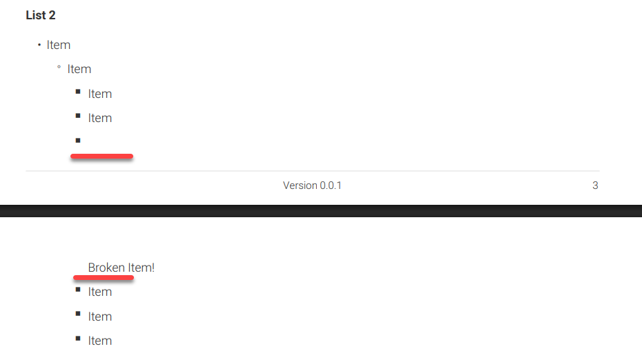

# Reproducing bug with bullet list in PDF

To create a PDF where the bullet lies on other page from the bullet:

1. Install dependencies by running `npm install` in repository root.
2. Generate PDF by running `npm run generate:pdf:win --docversion=0.0.1` in repository root.
3. View the PDF in `build/site/latest/en/reproducing-bullet-list-bug.pdf`.

On pages 3-4, you should see the following problem:

